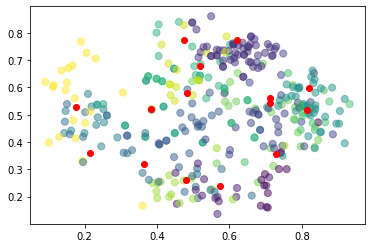
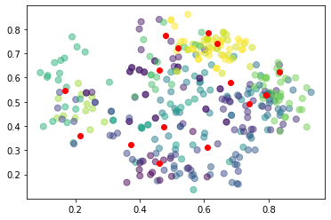
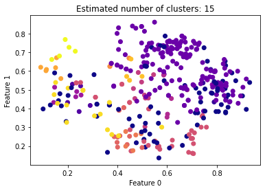
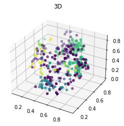
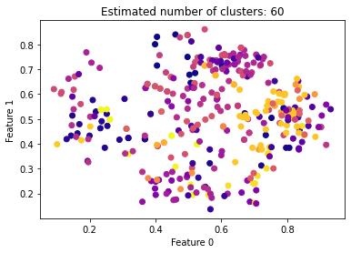
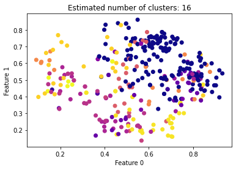
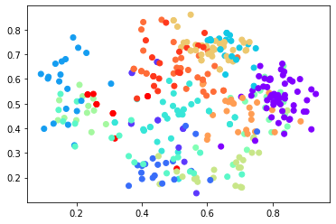
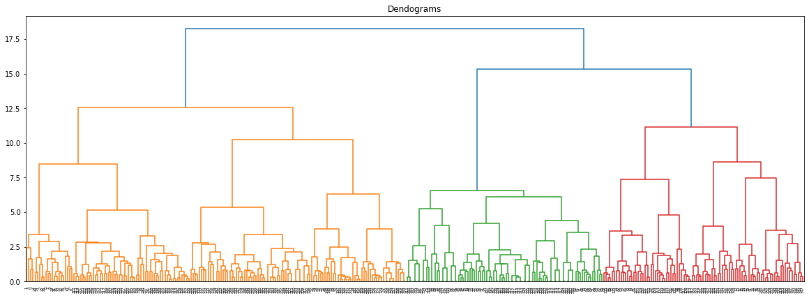

```python
import numpy as np
import pandas as pd
from matplotlib import pyplot as plt

from sklearn.cluster import KMeans
%matplotlib inline

from sklearn.datasets.samples_generator import make_blobs


from sklearn.preprocessing import StandardScaler
from sklearn.cluster import DBSCAN
from sklearn import metrics

from mpl_toolkits.mplot3d import Axes3D

from sklearn.cluster import SpectralClustering

from sklearn.cluster import AgglomerativeClustering
import scipy.cluster.hierarchy as shc
```


```python
df = pd.read_csv('E:\\UNI\\Term 7\\Amirkhani - Dade Kavi\\0-Projects\\2-Second Project\\movement_libras-no tag.csv', header=None)
```


```python
df.head()
```


<div>
<style scoped>
    .dataframe tbody tr th:only-of-type {
        vertical-align: middle;
    }

    .dataframe tbody tr th {
        vertical-align: top;
    }

    .dataframe thead th {
        text-align: right;
    }
</style>
<table border="1" class="dataframe">
  <thead>
    <tr style="text-align: right;">
      <th></th>
      <th>0</th>
      <th>1</th>
      <th>2</th>
      <th>3</th>
      <th>4</th>
      <th>5</th>
      <th>6</th>
      <th>7</th>
      <th>8</th>
      <th>9</th>
      <th>...</th>
      <th>80</th>
      <th>81</th>
      <th>82</th>
      <th>83</th>
      <th>84</th>
      <th>85</th>
      <th>86</th>
      <th>87</th>
      <th>88</th>
      <th>89</th>
    </tr>
  </thead>
  <tbody>
    <tr>
      <th>0</th>
      <td>0.79691</td>
      <td>0.38194</td>
      <td>0.79691</td>
      <td>0.37731</td>
      <td>0.79884</td>
      <td>0.37731</td>
      <td>0.79497</td>
      <td>0.37731</td>
      <td>0.77563</td>
      <td>0.35417</td>
      <td>...</td>
      <td>0.34043</td>
      <td>0.51389</td>
      <td>0.39845</td>
      <td>0.42593</td>
      <td>0.47389</td>
      <td>0.36111</td>
      <td>0.55899</td>
      <td>0.31250</td>
      <td>0.63830</td>
      <td>0.29398</td>
    </tr>
    <tr>
      <th>1</th>
      <td>0.67892</td>
      <td>0.27315</td>
      <td>0.68085</td>
      <td>0.27315</td>
      <td>0.68085</td>
      <td>0.27315</td>
      <td>0.68085</td>
      <td>0.27315</td>
      <td>0.67892</td>
      <td>0.26852</td>
      <td>...</td>
      <td>0.19536</td>
      <td>0.57407</td>
      <td>0.17795</td>
      <td>0.63657</td>
      <td>0.17215</td>
      <td>0.67361</td>
      <td>0.17021</td>
      <td>0.69213</td>
      <td>0.17215</td>
      <td>0.69213</td>
    </tr>
    <tr>
      <th>2</th>
      <td>0.72147</td>
      <td>0.23611</td>
      <td>0.72340</td>
      <td>0.23611</td>
      <td>0.72340</td>
      <td>0.23611</td>
      <td>0.72340</td>
      <td>0.23611</td>
      <td>0.72340</td>
      <td>0.23611</td>
      <td>...</td>
      <td>0.52031</td>
      <td>0.30556</td>
      <td>0.59768</td>
      <td>0.25926</td>
      <td>0.67118</td>
      <td>0.25231</td>
      <td>0.73501</td>
      <td>0.26620</td>
      <td>0.78143</td>
      <td>0.27778</td>
    </tr>
    <tr>
      <th>3</th>
      <td>0.56480</td>
      <td>0.32407</td>
      <td>0.56286</td>
      <td>0.32407</td>
      <td>0.56093</td>
      <td>0.32407</td>
      <td>0.55899</td>
      <td>0.32407</td>
      <td>0.55899</td>
      <td>0.32407</td>
      <td>...</td>
      <td>0.20503</td>
      <td>0.49074</td>
      <td>0.26306</td>
      <td>0.42361</td>
      <td>0.33269</td>
      <td>0.34722</td>
      <td>0.41006</td>
      <td>0.28009</td>
      <td>0.49130</td>
      <td>0.24306</td>
    </tr>
    <tr>
      <th>4</th>
      <td>0.67118</td>
      <td>0.38426</td>
      <td>0.67118</td>
      <td>0.38657</td>
      <td>0.67311</td>
      <td>0.38657</td>
      <td>0.67311</td>
      <td>0.38426</td>
      <td>0.67311</td>
      <td>0.37963</td>
      <td>...</td>
      <td>0.46422</td>
      <td>0.76389</td>
      <td>0.44101</td>
      <td>0.64120</td>
      <td>0.45068</td>
      <td>0.54167</td>
      <td>0.47776</td>
      <td>0.44213</td>
      <td>0.53191</td>
      <td>0.34259</td>
    </tr>
  </tbody>
</table>
<p>5 rows × 90 columns</p>
</div>


```python
#######################################################
#######################################################
#######################################################    df_true
#######################################################
#######################################################
```


```python
df_true = pd.read_csv('E:\\UNI\\Term 7\\Amirkhani - Dade Kavi\\0-Projects\\2-Second Project\\movement_libras.csv', header=None)
```


```python
df_true.tail()
```


<div>
<style scoped>
    .dataframe tbody tr th:only-of-type {
        vertical-align: middle;
    }

    .dataframe tbody tr th {
        vertical-align: top;
    }

    .dataframe thead th {
        text-align: right;
    }
</style>
<table border="1" class="dataframe">
  <thead>
    <tr style="text-align: right;">
      <th></th>
      <th>0</th>
      <th>1</th>
      <th>2</th>
      <th>3</th>
      <th>4</th>
      <th>5</th>
      <th>6</th>
      <th>7</th>
      <th>8</th>
      <th>9</th>
      <th>...</th>
      <th>81</th>
      <th>82</th>
      <th>83</th>
      <th>84</th>
      <th>85</th>
      <th>86</th>
      <th>87</th>
      <th>88</th>
      <th>89</th>
      <th>90</th>
    </tr>
  </thead>
  <tbody>
    <tr>
      <th>355</th>
      <td>0.65957</td>
      <td>0.79167</td>
      <td>0.65764</td>
      <td>0.78704</td>
      <td>0.65957</td>
      <td>0.78935</td>
      <td>0.65957</td>
      <td>0.78704</td>
      <td>0.65764</td>
      <td>0.78241</td>
      <td>...</td>
      <td>0.55093</td>
      <td>0.57253</td>
      <td>0.53935</td>
      <td>0.56286</td>
      <td>0.53241</td>
      <td>0.55126</td>
      <td>0.52546</td>
      <td>0.54159</td>
      <td>0.52083</td>
      <td>15</td>
    </tr>
    <tr>
      <th>356</th>
      <td>0.64023</td>
      <td>0.71991</td>
      <td>0.64217</td>
      <td>0.71759</td>
      <td>0.64217</td>
      <td>0.71759</td>
      <td>0.64217</td>
      <td>0.71759</td>
      <td>0.64217</td>
      <td>0.71991</td>
      <td>...</td>
      <td>0.50463</td>
      <td>0.55513</td>
      <td>0.50231</td>
      <td>0.54352</td>
      <td>0.49769</td>
      <td>0.53191</td>
      <td>0.49537</td>
      <td>0.52031</td>
      <td>0.49306</td>
      <td>15</td>
    </tr>
    <tr>
      <th>357</th>
      <td>0.61122</td>
      <td>0.75926</td>
      <td>0.61122</td>
      <td>0.75694</td>
      <td>0.61315</td>
      <td>0.75694</td>
      <td>0.61122</td>
      <td>0.75694</td>
      <td>0.61122</td>
      <td>0.75926</td>
      <td>...</td>
      <td>0.54167</td>
      <td>0.48549</td>
      <td>0.53472</td>
      <td>0.47195</td>
      <td>0.52546</td>
      <td>0.45841</td>
      <td>0.52083</td>
      <td>0.44487</td>
      <td>0.51620</td>
      <td>15</td>
    </tr>
    <tr>
      <th>358</th>
      <td>0.65957</td>
      <td>0.79167</td>
      <td>0.65764</td>
      <td>0.78704</td>
      <td>0.65957</td>
      <td>0.78935</td>
      <td>0.65957</td>
      <td>0.78704</td>
      <td>0.65764</td>
      <td>0.78241</td>
      <td>...</td>
      <td>0.55093</td>
      <td>0.57253</td>
      <td>0.53935</td>
      <td>0.56286</td>
      <td>0.53241</td>
      <td>0.55126</td>
      <td>0.52546</td>
      <td>0.54159</td>
      <td>0.52083</td>
      <td>15</td>
    </tr>
    <tr>
      <th>359</th>
      <td>0.64023</td>
      <td>0.71991</td>
      <td>0.64217</td>
      <td>0.71759</td>
      <td>0.64217</td>
      <td>0.71759</td>
      <td>0.64217</td>
      <td>0.71759</td>
      <td>0.64217</td>
      <td>0.71991</td>
      <td>...</td>
      <td>0.50463</td>
      <td>0.55513</td>
      <td>0.50231</td>
      <td>0.54352</td>
      <td>0.49769</td>
      <td>0.53191</td>
      <td>0.49537</td>
      <td>0.52031</td>
      <td>0.49306</td>
      <td>15</td>
    </tr>
  </tbody>
</table>
<p>5 rows × 91 columns</p>
</div>


```python
labels_true = []
for i in range(0, 360):
    labels_true.append(df_true.values[i,90])
```


```python
print(labels_true)
```

    [1.0, 1.0, 1.0, 1.0, 1.0, 1.0, 1.0, 1.0, 1.0, 1.0, 1.0, 1.0, 1.0, 1.0, 1.0, 1.0, 1.0, 1.0, 1.0, 1.0, 1.0, 1.0, 1.0, 1.0, 2.0, 2.0, 2.0, 2.0, 2.0, 2.0, 2.0, 2.0, 2.0, 2.0, 2.0, 2.0, 2.0, 2.0, 2.0, 2.0, 2.0, 2.0, 2.0, 2.0, 2.0, 2.0, 2.0, 2.0, 3.0, 3.0, 3.0, 3.0, 3.0, 3.0, 3.0, 3.0, 3.0, 3.0, 3.0, 3.0, 3.0, 3.0, 3.0, 3.0, 3.0, 3.0, 3.0, 3.0, 3.0, 3.0, 3.0, 3.0, 4.0, 4.0, 4.0, 4.0, 4.0, 4.0, 4.0, 4.0, 4.0, 4.0, 4.0, 4.0, 4.0, 4.0, 4.0, 4.0, 4.0, 4.0, 4.0, 4.0, 4.0, 4.0, 4.0, 4.0, 5.0, 5.0, 5.0, 5.0, 5.0, 5.0, 5.0, 5.0, 5.0, 5.0, 5.0, 5.0, 5.0, 5.0, 5.0, 5.0, 5.0, 5.0, 5.0, 5.0, 5.0, 5.0, 5.0, 5.0, 6.0, 6.0, 6.0, 6.0, 6.0, 6.0, 6.0, 6.0, 6.0, 6.0, 6.0, 6.0, 6.0, 6.0, 6.0, 6.0, 6.0, 6.0, 6.0, 6.0, 6.0, 6.0, 6.0, 6.0, 7.0, 7.0, 7.0, 7.0, 7.0, 7.0, 7.0, 7.0, 7.0, 7.0, 7.0, 7.0, 7.0, 7.0, 7.0, 7.0, 7.0, 7.0, 7.0, 7.0, 7.0, 7.0, 7.0, 7.0, 8.0, 8.0, 8.0, 8.0, 8.0, 8.0, 8.0, 8.0, 8.0, 8.0, 8.0, 8.0, 8.0, 8.0, 8.0, 8.0, 8.0, 8.0, 8.0, 8.0, 8.0, 8.0, 8.0, 8.0, 9.0, 9.0, 9.0, 9.0, 9.0, 9.0, 9.0, 9.0, 9.0, 9.0, 9.0, 9.0, 9.0, 9.0, 9.0, 9.0, 9.0, 9.0, 9.0, 9.0, 9.0, 9.0, 9.0, 9.0, 10.0, 10.0, 10.0, 10.0, 10.0, 10.0, 10.0, 10.0, 10.0, 10.0, 10.0, 10.0, 10.0, 10.0, 10.0, 10.0, 10.0, 10.0, 10.0, 10.0, 10.0, 10.0, 10.0, 10.0, 11.0, 11.0, 11.0, 11.0, 11.0, 11.0, 11.0, 11.0, 11.0, 11.0, 11.0, 11.0, 11.0, 11.0, 11.0, 11.0, 11.0, 11.0, 11.0, 11.0, 11.0, 11.0, 11.0, 11.0, 12.0, 12.0, 12.0, 12.0, 12.0, 12.0, 12.0, 12.0, 12.0, 12.0, 12.0, 12.0, 12.0, 12.0, 12.0, 12.0, 12.0, 12.0, 12.0, 12.0, 12.0, 12.0, 12.0, 12.0, 13.0, 13.0, 13.0, 13.0, 13.0, 13.0, 13.0, 13.0, 13.0, 13.0, 13.0, 13.0, 13.0, 13.0, 13.0, 13.0, 13.0, 13.0, 13.0, 13.0, 13.0, 13.0, 13.0, 13.0, 14.0, 14.0, 14.0, 14.0, 14.0, 14.0, 14.0, 14.0, 14.0, 14.0, 14.0, 14.0, 14.0, 14.0, 14.0, 14.0, 14.0, 14.0, 14.0, 14.0, 14.0, 14.0, 14.0, 14.0, 15.0, 15.0, 15.0, 15.0, 15.0, 15.0, 15.0, 15.0, 15.0, 15.0, 15.0, 15.0, 15.0, 15.0, 15.0, 15.0, 15.0, 15.0, 15.0, 15.0, 15.0, 15.0, 15.0, 15.0]


```python
#######################################################
#######################################################
#######################################################    K-Means
#######################################################
#######################################################
```


```python
kmeans = KMeans(n_clusters=15, init='random').fit(df)
centroids = kmeans.cluster_centers_
labels = kmeans.labels_
#print(centroids)


```


```python
plt.scatter(df[df.columns[0]],df[df.columns[19]],c= kmeans.labels_.astype(float), s=50, alpha=0.5)
plt.scatter(centroids[:, 0], centroids[:, 1], c='red')
plt.show()
```


    

    


```python
print(labels)
```

    [11 11 11 11 11  3 11 11 11 11 11 11  6  6  6  6  6  6 11  9 11 11 11 11
     11 11 11 11  3  3 11 11 11 11  7 11  6  6  6  6  6  6  9  9 11  9  9 11
      3  3  3  4  3  3  3  3  3  9  3  3  4  4  4  4  4  4  4  4  4  4  4  4
      1  1  1  1 10  1  1  1  0  0  0  1  1  5  1  1  1  1  8  8  8  8  8  8
     12 12 14  3 12 12 12 12 12 12 12 12 12 12 12 12 12 12  4  4  4  4  4  4
      0  0  0  1  4  5  5  0  0  0  0  0  5  5  5  1  5  5  8  8  8  8  8  8
     10 10 10  7  3  3  7  7  7  7  7  7  7  7  7  7  3  7  9  9  9  9  9  9
      3  3  2 13  3  2  2  2  2  2  2  2  2  2  2  2  2  2  2  9 13  9  9 13
      3  3  3  4  3  3  3  3  3  3  3  3  4  4  4  4  4  4  9  9  9  9  9  9
      7  7  7 14  7 10  7  7  7  7  7  7 14 14 14 14 14 14  9  9  9  9  9  9
      2  2  2 13  2  2  2  2  2  2  2  2 13 13 13 13 13  2  2  2  2  2  2  2
     10 10  7  7 10  7  7  7  7  7  7  7  7  7  7  7  7  7  9  9  4  9  9  4
      2  2  2 13  2  3  2  2  2  2  2  2  2  2 13 13 13 13 13  2  2 13  2  2
      7  7  7  8 12  5  5  5  5  5  5  5  5  5  5  5  5  5  8  5  8  8  5  8
     10 10 10 14 10 10 14 14 14 14 14 14 14 14 14 14 14 14  2  2  2  2  2  2]


```python
labels_true = labels_true
labels_pred = labels
# Adjusted Rand index is a function that measures the similarity of the two assignments
metrics.adjusted_rand_score(labels_true, labels_pred)
```


    0.30422819962254993


```python
# Completeness: all members of a given class are assigned to the same cluster.
metrics.completeness_score(labels_true, labels_pred)
```


    0.602184466465233


```python
# Homogeneity: each cluster contains only members of a single class.
metrics.homogeneity_score(labels_true, labels_pred)
```


    0.5778107029992462


```python
# Their harmonic mean called V-measure
metrics.v_measure_score(labels_true, labels_pred)
```


    0.5897458547417831


```python
#True False Positive Negative
metrics.fowlkes_mallows_score(labels_true, labels_pred)
```


    0.3560178562397647


```python
# A higher Silhouette Coefficient score relates to a model with better defined clusters. 
# a: The mean distance between a sample and all other points in the same class.
# b: The mean distance between a sample and all other points in the next nearest cluster.
metrics.silhouette_score(df, labels, metric='euclidean')
```


    0.2482608020621872


```python
#######################################################
#######################################################
#######################################################    K-Means++
#######################################################
#######################################################
```


```python
kmeanspp = KMeans(n_clusters=15, init='k-means++').fit(df)
centroids = kmeanspp.cluster_centers_
labels = kmeanspp.labels_
#print(centroids)


```


```python
plt.scatter(df[df.columns[0]],df[df.columns[19]],c= kmeanspp.labels_.astype(float), s=50, alpha=0.5)
plt.scatter(centroids[:, 0], centroids[:, 1], c='red')
plt.show()
```


    

    


```python
print(labels)
```

    [ 7  8  7  7  7  2  7  7  7  7  7  7 12 12 12 12 12 12  7  7  7  7  7  7
      7  2  2  7  2  2  7  7  7  7 11  7 12 12 12 12 12 12  7  1  7  7  7  7
      2  2  2  6  2  2  6  2  6 13  6  6  6  6  6  6  6  6  6  6  6  6  6  6
      4  4  4  8  2  4  4  4  4  4  4  4  8  4  8  4  4  4  1  1  4  1  1  4
      0  0  0  2  0  0  0  8  0  0  0  0  0  0  0  0  0  0  8  8  8  8  8  8
      4  4  4  4  8  3  3  4  3  4  4  4  3  3  3  4  3  3  1  1  1  1  1  1
      5  5  5  5  2  2 11 11 11 11 11 11  5  5  5  5  2  5  1  1  1  1  1  1
     13  2 13 10 13 13 14 13 13 13 14 13 14 14 14 13 13 14 13  1 10  1  1 10
      2  2  2  8  2  2 13  2  2  2  2  2  1  8  8  8  8  8  1  1  1  1  1  1
      5 11 11  9 11  5 11 11 11 11 11 11  9  9  9  9  9  9  1  1  1  1  1  1
     14 13 14 10 13 13 14 13 14 14 14 14 10 10 10 10 10 14 14 13 14 14 13 14
      5  5 11 11  5 11 11 11 11 11 11 11 11 11 11 11 11 11  1  1  5  1  1  5
     14 14 14 10 14 13 14 14 14 14 14 14 14 10 10 10 10 14 10 14 14 10 14 14
      5 11 11  1  2  3  3  3  3  3  3  3  3  3  3  3  3  3  1  3  4  1  3  4
      5  5  5  9  2  5  9  9  9  9  9  9  9  9  9  9  9  9 13 13 13 13 13 13]


```python
labels_true = labels_true
labels_pred = labels
metrics.adjusted_rand_score(labels_true, labels_pred)
```


    0.3184947827251794


```python
metrics.completeness_score(labels_true, labels_pred)
```


    0.5980981555238238


```python
metrics.homogeneity_score(labels_true, labels_pred)
```


    0.5870016684060961


```python
metrics.v_measure_score(labels_true, labels_pred)
```


    0.5924979618997134


```python
metrics.fowlkes_mallows_score(labels_true, labels_pred)
```


    0.36480423493398817


```python
metrics.silhouette_score(df, labels, metric='euclidean')
```


    0.2339061810252735


```python
#######################################################
#######################################################
#######################################################    DBScan
#######################################################
#######################################################
```


```python
from sklearn.cluster import DBSCAN
from sklearn.preprocessing import StandardScaler
scaler = StandardScaler()
X_scaled = scaler.fit_transform(df)

#dbscan = DBSCAN(eps=4.07, min_samples = 3)

#dbscan = DBSCAN(eps=4.142, min_samples = 6)
#dbscan = DBSCAN(eps=4.17, min_samples = 5)

dbscan = DBSCAN(eps=4.99965, min_samples = 4)

#dbscan = DBSCAN(eps=5.089, min_samples = 3)
#dbscan = DBSCAN(eps=5.356, min_samples = 2)

clusters = dbscan.fit_predict(X_scaled)

labels = dbscan.labels_

n_clusters_ = len(set(labels)) - (1 if -1 in labels else 0)
n_noise_ = list(labels).count(-1)

plt.scatter(df[df.columns[0]], df[df.columns[19]], c=clusters, cmap="plasma")
plt.xlabel("Feature 0")
plt.ylabel("Feature 1")
plt.title('Estimated number of clusters: %d' % n_clusters_)
print('Estimated number of noises: %d' % n_noise_)
```

    Estimated number of noises: 78


    

    


```python
fig = plt.figure()
ax = fig.add_subplot(111, projection='3d')
ax.scatter(
    xs=df[df.columns[0]], 
    ys=df[df.columns[19]], 
    zs=df[df.columns[29]],
    c=clusters
)
ax.set_title('3D', x=0.5);
```


    

    


```python
print(labels)
```

    [-1 -1 -1 -1 -1 -1 -1  0  0  0 -1 -1  1 -1  1 -1  1  1  2  2 -1  2 -1 -1
     -1 -1 -1 -1 -1 -1  3  3  3  3 -1  3  4  4  4 -1  4  4  2  2  2  2  2  2
     -1 -1 -1 -1 -1 -1  5  5  5 16  5  5  6  6  7  7 -1  7  6  6  6  6  6  6
      8  9  8 -1 -1  9  9  9  9 -1  9  9 -1 -1 -1  8  8  8 -1 -1 -1 -1 -1 -1
     10 -1 -1 -1 -1 10 10 10 10 10 10 10 11 11 11 11 11 10 12 -1 12 12 -1 12
     13 -1 -1  8 -1 -1 -1 -1 -1 13 13 -1 22 -1 -1  8 -1 -1 -1 14 14 -1 14 14
     15 15 15 15 15 15 15 15 15 15 15 15 15 15 15 15 15 15  2  2  2  2  2  2
     16 -1 16 -1 -1 16 16 16 16 16 16 16 16 16 16 16 16 16 16  2 -1  2  2 -1
     15 15 15  2 15 15 15 15 15 15 15 15  2  2  2  2  2  2  2  2  2  2  2  2
     15 15 15 -1 -1 -1 15 -1 -1 -1 -1 -1 17 17 17 17 17 17  2 -1  2  2 -1  2
     16 16 16 -1 16 -1 -1 16 16 16 16 16 18 -1 18 18 18 -1 16 -1 16 16 -1 16
     -1 -1 15 15 -1 15 15 15 15 15 15 15 15 -1 15 15 15 -1 19 19 -1 19 19 -1
     16 16 16 -1 -1 16 16 16 16 16 16 16 -1 -1 -1 -1 -1 -1 -1 16 -1 -1 16 -1
     20 20 20 21 -1 22 -1 22 -1 22 22 22 22 22 22 22 22 22 21 -1 -1 21 -1 -1
     -1 -1 -1 -1 -1 -1 23 -1 23 23 -1 23 24 24 24 -1 -1 -1 16 16 16 16 16 16]


```python
labels_true = labels_true
labels_pred = labels
metrics.adjusted_rand_score(labels_true, labels_pred)
```


    0.13060028204603014


```python
metrics.completeness_score(labels_true, labels_pred)
```


    0.554642170078339


```python
metrics.homogeneity_score(labels_true, labels_pred)
```


    0.4942057151586411


```python
metrics.v_measure_score(labels_true, labels_pred)
```


    0.5226827153467988


```python
metrics.fowlkes_mallows_score(labels_true, labels_pred)
```


    0.2313754119118894


```python
metrics.silhouette_score(df, labels, metric='euclidean')
```


    0.05207486258290556


```python
#######################################################
#######################################################
#######################################################    Spectral Clustering
#######################################################
#######################################################
```


```python
scaler = StandardScaler()
X_scaled = scaler.fit_transform(df)

spec_clustering = SpectralClustering(n_clusters=90, assign_labels="discretize", random_state=0)
clusters = spec_clustering.fit_predict(X_scaled)

labels = spec_clustering.labels_

n_clusters_ = len(set(labels)) - (1 if -1 in labels else 0)
n_noise_ = list(labels).count(-1)

plt.scatter(df[df.columns[0]], df[df.columns[19]], c=clusters, cmap="plasma")
plt.xlabel("Feature 0")
plt.ylabel("Feature 1")
plt.title('Estimated number of clusters: %d' % n_clusters_)
print('Estimated number of noises: %d' % n_noise_)
```

    Estimated number of noises: 0


    

    


```python
scaler = StandardScaler()
X_scaled = scaler.fit_transform(df)

spec_clustering = SpectralClustering(n_clusters=30, assign_labels="discretize", random_state=0)
clusters = spec_clustering.fit_predict(X_scaled)

labels = spec_clustering.labels_

n_clusters_ = len(set(labels)) - (1 if -1 in labels else 0)
n_noise_ = list(labels).count(-1)

plt.scatter(df[df.columns[0]], df[df.columns[19]], c=clusters, cmap="plasma")
plt.xlabel("Feature 0")
plt.ylabel("Feature 1")
plt.title('Estimated number of clusters: %d' % n_clusters_)
print('Estimated number of noises: %d' % n_noise_)
```

    Estimated number of noises: 0


    

    


```python
print(labels)
```

    [ 7 12  7  5  7 19  7  4  4  4  4  7  8  8  8  8  8  8  0  0  0  0  0  0
      4 19 19  0  7  1  4  4  4  4  7  4 21 21 21  1 21 21  0  0  0  0  0  0
     15 15 15 12  4  4 15 15 15  0 15 15 12 12 12 12 12 12 12 12 12 12 12 12
     20 20 20 20  0 20 20 20 20 20 20 20 10  9 20 20 20 20  3 20 20  3 20 20
      8  8  4  4  8  8  8  8  8  8  8  8  4  4  4  4  4  8  8 20  8  8 20  8
     20 20 20 20 10  4 20 20 20 20 20 20  9  9  9 20  9  9  3  6  6  3  6  6
      0  0  0  0  0  0  0  0  0  0  0  0  0  0  0  0  0  0  0  0  0  0  0  0
      0  0  0 19  0  0  0  0  0  0  0  0  0  0  0  0  0  0  0  0 19  0  0 19
      0  0  0  0  0  0  0  0  0  0  0  0  0  0  0  0  0  0  0  0  0  0  0  0
      0  0  0  4  0 15  0  0  0  0  0  0 15 15 15 15 15 15  0  0  0  0  0  0
      0  0  0 19  0  0  0  0  0  0  0  0 19 12 19 19 19  0  0  0  0  0  0  0
      0  0  0  0 15  0  0  0  0  0  0  0  0  0  0  0  0  0  0  0  2  0  0  2
      0  0  0 19  0  0  0  0  0  0  0  0 19 12 12 12 12  0 21  0  6 21  0  6
      4  4  4  9  5  9  9  9  9  9  9  9  9  9  9  9  9  9  9  9  9  9  9  9
      8 15  8 19  4 15 19 19 19 19 19 19 19 19 19 19 19 19  0  0  0  0  0  0]


```python
labels_true = labels_true
labels_pred = labels
metrics.adjusted_rand_score(labels_true, labels_pred)
```


    0.15400007542790925


```python
metrics.completeness_score(labels_true, labels_pred)
```


    0.5756133750622596


```python
metrics.homogeneity_score(labels_true, labels_pred)
```


    0.4269278734979198


```python
metrics.v_measure_score(labels_true, labels_pred)
```


    0.49024495406093943


```python
metrics.fowlkes_mallows_score(labels_true, labels_pred)
```


    0.28774517620539974


```python
metrics.silhouette_score(df, labels, metric='euclidean')
```


    -0.014619127216316169


```python
#######################################################
#######################################################
#######################################################    Hierarchical Clustering
#######################################################
#######################################################
```


```python
cluster = AgglomerativeClustering(n_clusters=15, affinity='euclidean', linkage='ward')
clusters= cluster.fit_predict(df)
labels = cluster.labels_
```


```python
plt.scatter(df[df.columns[0]],df[df.columns[19]], c=cluster.labels_, cmap='rainbow')
```


    <matplotlib.collections.PathCollection at 0x26d059bf6a0>


    

    


```python
plt.figure(figsize=(20, 7))
plt.title("Dendograms")
dend = shc.dendrogram(shc.linkage(df, method='ward'))
```


    

    


```python
print(labels)
```

    [ 7  7  7  7  7  7  7  7  7  7  7  7  8  8  8  8  8  8 12 12 12 12 12 12
      7  7  7 12  7 11  7  7  7  7  7  7  8  8  8  8  8  8 12 12 12 12 12 12
     11 11 11  5 11 11 11 11 11  4 11 11  5  5  5  5  5  5  5  5  5  5  5  5
      9  9  9  1  0  9  9  9  9  9  9  9  1 14  1  9  9  9  1  1  1  1  1  1
      2  2  2  2  2  2  2  2  2  2  2  2  2  2  2  2  2  2  5  5  5  5  5  5
      9  9  9  9  5  6  6  9  6  9  9  9  6  6  6  9  6  6 14  1  1 14  1  1
      0  0  0  0 11 11  0  0  0  0  0  0  0  0  0  0  0  0 12 12 12 12 12 12
      4  4  4 13  4  4 10  4  4  4 10  4 10 10 10 10 10 10  4 12 13 12 12 13
     11 11 11  5 11 11  4 11 11 11 11 11  5  5  5  5  5  5 12 12 12 12 12 12
      0  0  0  3  0  0  0  0  0  0  0  0  3  3  3  3  3  3 12 12 12 12 12 12
     10 10 10 13  4  4 10 10 10 10 10 10 13 13 13 13 13 10 10 10 10 10 10 10
      0  0  0  0  0  0  0  0  0  0  0  0  0  0  0  0  0  0  5  5  5  5  5  5
     10 10 10 13 10  4 10 10 10 10 10 10 13 13 13 13 13 13 13 10 10 13 10 10
      0  0  0 14  2  6 14  6  6  6  6  6  6  6  6  6  6  6 14 14 14 14 14 14
      0  0  0  3  0  0  3  3  3  3  3  3  3  3  3  3  3  3  4  4  4  4  4  4]


```python
labels_true = labels_true
labels_pred = labels
metrics.adjusted_rand_score(labels_true, labels_pred)
```


    0.3154097370813925


```python
metrics.completeness_score(labels_true, labels_pred)
```


    0.6268835437201143


```python
metrics.homogeneity_score(labels_true, labels_pred)
```


    0.6048839711877185


```python
metrics.v_measure_score(labels_true, labels_pred)
```


    0.61568729944307


```python
metrics.fowlkes_mallows_score(labels_true, labels_pred)
```


    0.36541603008052526


```python
metrics.silhouette_score(df, labels, metric='euclidean')
```


    0.243049361476811


